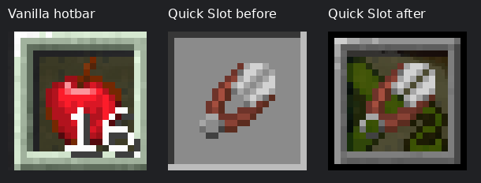
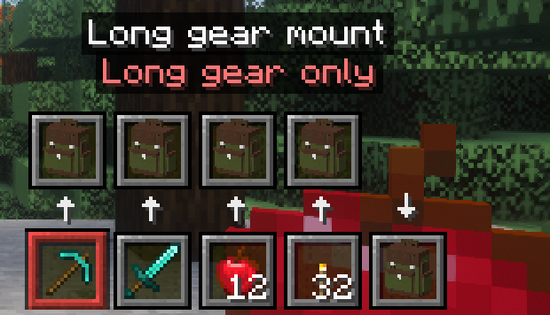
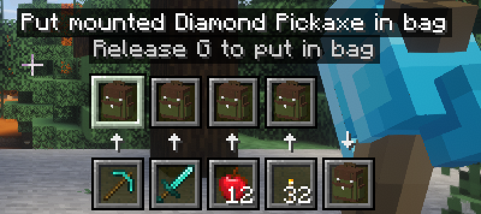
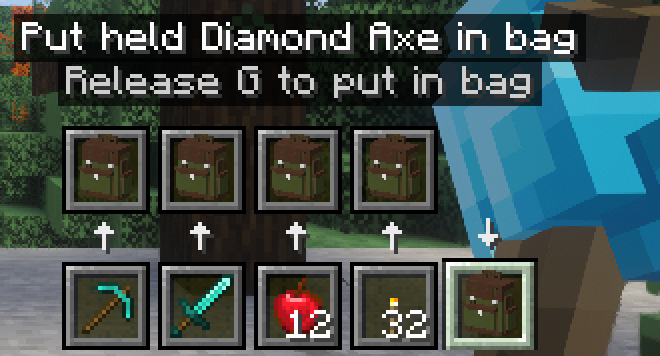
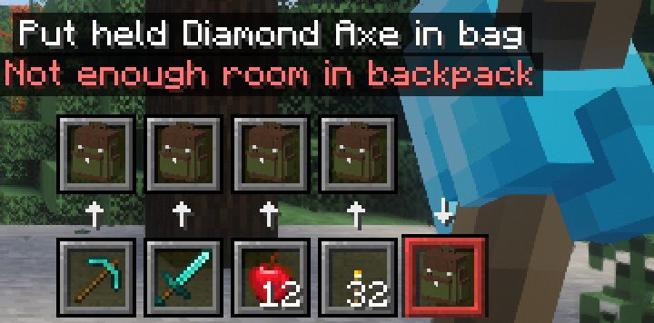
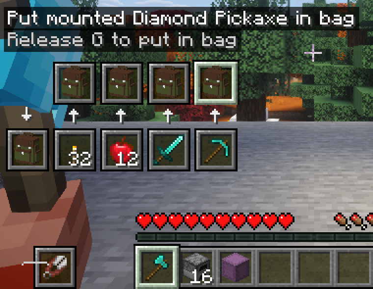
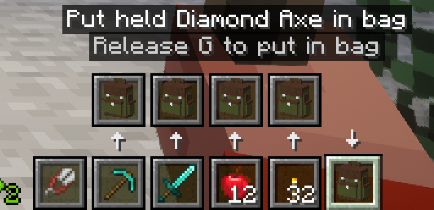

# Explicit backpack stowing and vanilla HUD — 2026-09-18

Versions: Backpacks+ 0.2.0, protocol 4; Quick Slot 0.1.1. Implemented under
Backpacks+ D-0023 and Quick Slot D-0013. Publication and deployment are held.

## Reproduction and regression

The pre-change shader-enabled client used native X keyboard and wheel input:
hold G, scroll to an occupied incompatible mount, release G. Sixteen held apples
went into ordinary storage when drawing the mounted diamond pickaxe. A held
diamond axe similarly went into storage when drawing twelve mounted apples.
Empty mounts already refused these gestures. The new mismatch regression failed
on the unchanged server code at `mismatchedmountneverstowsimplicitly`.

## Final checks

- `./gradlew --no-watch-fs build -PtestCurios`: 13 JUnit tests and **41 real-server
  GameTests passed**, including real Curios equipment, both deposit sources,
  every bag tier, Creative/Survival, merging, partial/full storage, item components,
  forbidden portable storage, stale identity/revision/selection, replay and menu locks.
- Quick Slot `./gradlew --no-watch-fs build`: 26 JUnit and 22 real-server tests passed.
- The complete pack joined the private dedicated server with all mods restored,
  including Platform and Vanilla Backport. Iris and Complementary remained enabled.
  Native G/wheel/release checked both mismatch directions, held and direct mount
  stowing, both full-bag refusals, compatible exchange, drawing/restowing, G without
  scrolling and cancellation after changing hotbar selection. The server's real
  inventories and bag revisions establish the outcomes, not client animation.
- H still exchanged only the original Quick Slot. HUD captures cover right and left
  hands, normal and compact widths, attack-indicator clearance, warning borders and
  both labeled bag actions. [Structured results](explicit-stowing/runtime-checks.json).

The interaction driver waits for the fixture's five-tick state-report interval;
early timing assumptions read a stale selection before the native input was reported.
An event-path trace and explicit state acknowledgements resolved the test race.
No gameplay change was made in response to that fixture issue.

## Visual comparison

The former opaque inventory-style Quick Slot frame is replaced by the active
resource pack's vanilla hotbar edges and selection sprite. Mounts use those same
sprites. The selected incompatible mount adds an intentional red tint. Inspected
normal captures and enlarged nearest-neighbour crops show matching frame styling,
readable action labels and arrows, and no overlap with vanilla status/offhand areas
at the tested sizes (854x480, 640x480 and 1280x720, GUI scale 2).

## Environment and scope

Initial full-pack starts encountered the host's 128-instance inotify ceiling.
NeoForge's verified `disableConfigWatcher=true` setting was used only in disposable
test fixtures. The unrelated Platform library always creates its own watcher, so
Platform and Vanilla Backport were temporarily excluded during the first checks.
Once watcher capacity became available, **both jars were restored and the entire
native matrix passed again with the complete pack**. An unrelated intermittent
MidnightLib/Puzzle construction race also cleared on retry; it is not claimed fixed.

No host limit or production configuration was changed. File-based config hot reload
was not under test. One private rendering client was used, muted, with no personal
Prism changes. The client exited and the server stopped after confirming zero players.
These checks do not claim controller hardware or a multi-player load test.

The test fixture now compiles its vehicle helper against the pinned Maven Local
artifact, so cleaning a newer Vanilla Wheels build does not remove its dependency.
Scratch logs and original inventories: `/tmp/codex-mounts-materials-20260918/`.
