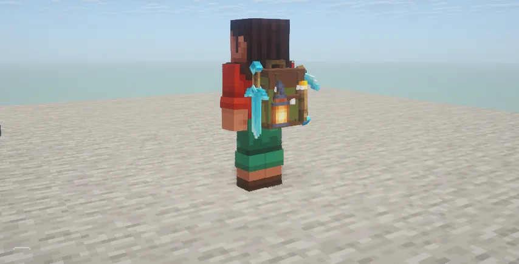
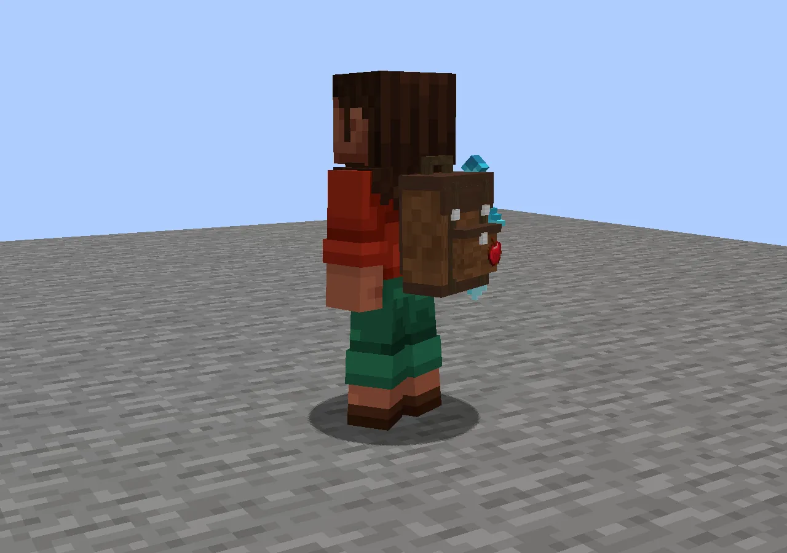
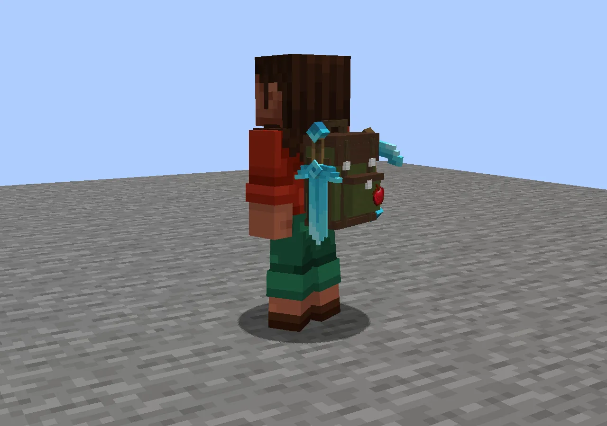
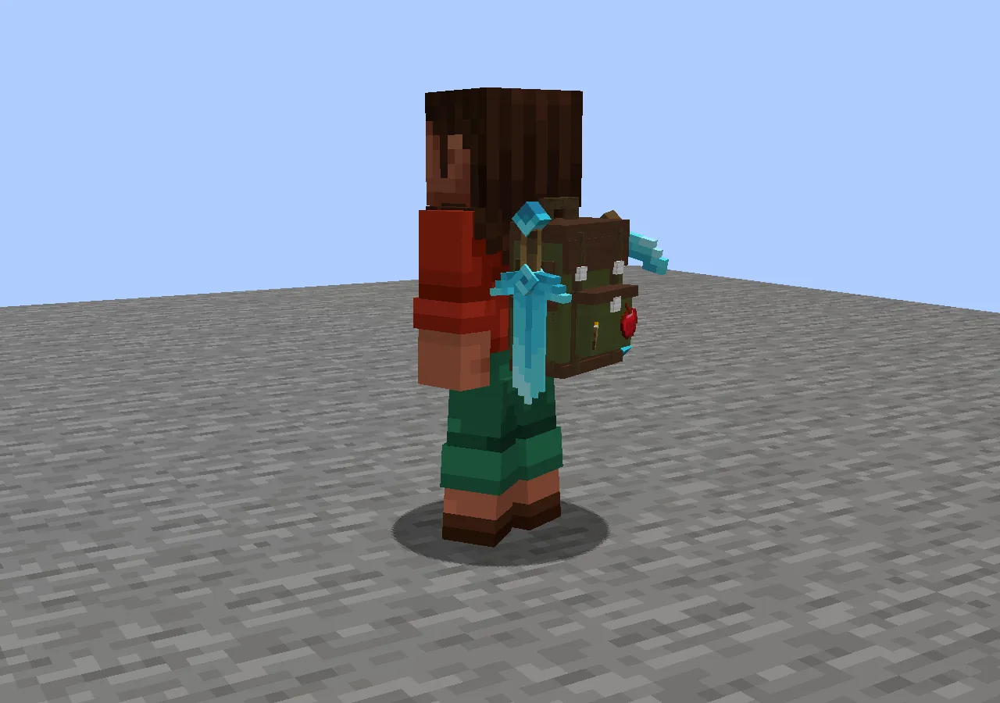
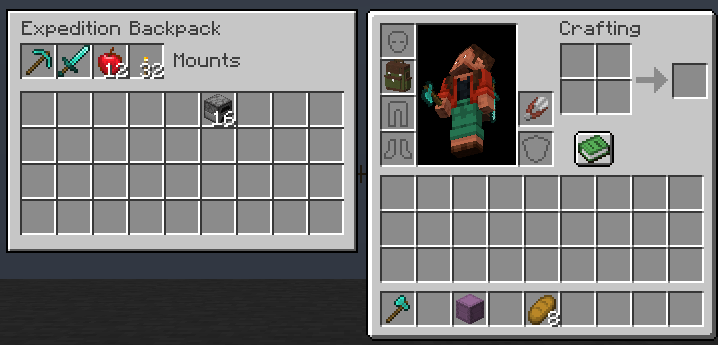
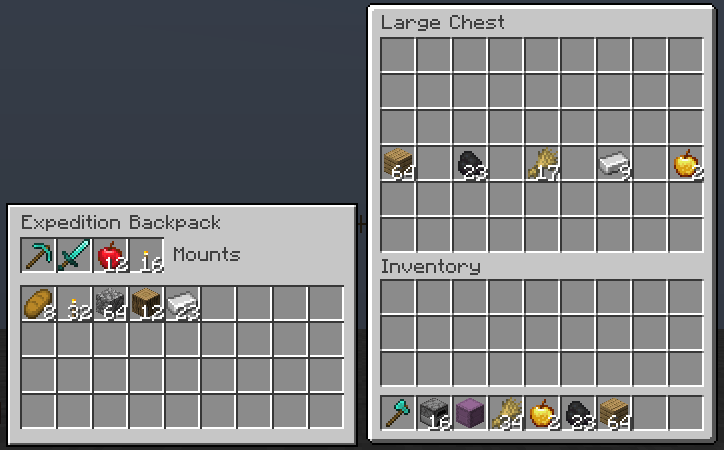
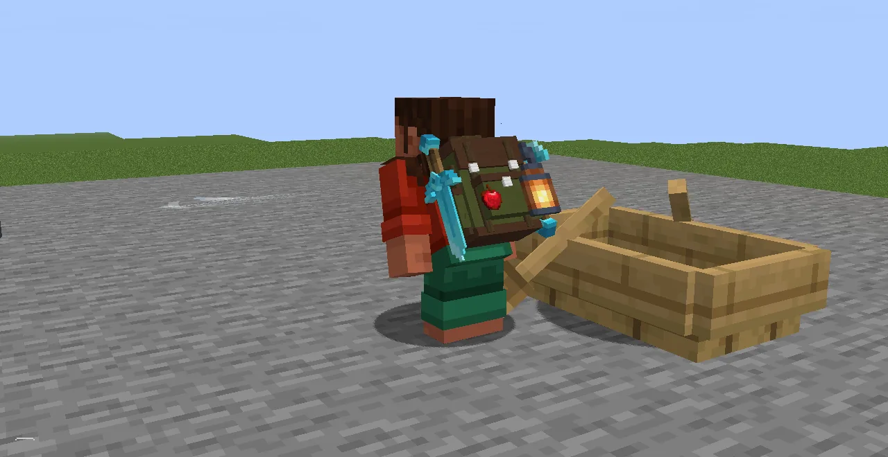

Rustic survival backpacks in three sizes. Swords, guns, bows and tools ride **mounted on the
sides**, small things on the front or hanging from the straps, and you can swap a mounted item into
your hand without opening anything. Worn, the bag's cells show **beside your inventory and beside
any chest**, and pickups, arrows, payments and crafting all reach into it.

## The three bags

| Bag | Storage cells | Mounts | Recipe (at a crafting table) |
|---|---|---|---|
| **Basic** | 9 | 2: one long, one small | 5 leather, 2 string, 1 wool of any colour |
| **Reinforced** | 18 | 3: two long, one small | a Basic backpack, 4 iron ingots, 1 leather, 2 string |
| **Expedition** | 36 | 4: two long, two small | a Reinforced backpack, 2 iron blocks, 2 leather, 2 honeycomb, 1 lead |

- **Upgrading keeps everything:** contents, mounted gear and name. No need to empty it first.
- **Colour:** add any dye in the bottom-centre cell when crafting. To recolour a bag, craft it with
  one dye anywhere in a grid (even the 2×2 in your inventory).
- **Long mounts** take full-size weapons and tools: rifles, shotguns, machine guns, bows, swords,
  shields, long-handled tools. **Small mounts** take pistols, knives, magazines, small tools and
  supplies.

## Using it

- **Open it:** hold the bag and right-click, or press **B** while wearing one.
- **Wear it** in the chest slot, or in Curios' **back** slot alongside a chestplate.
- **What fits:** almost anything, including furnaces, hoppers and bundles. Not other backpacks,
  chests, barrels or shulker boxes. A backpack can itself go in a chest.
- **With an elytra on,** the worn bag hides so the wings are clear. Everything still works.

## Swapping gear: G

**Hold G, scroll to a gear cell, release G** to swap it with the item in your hand. The highlight
starts on the first backpack slot, so for that one just tap G.

- Scroll to a **backpack icon** to put something *into* the bag instead: **Put mounted [item] in
  bag**, or **Put held [item] in bag**. Releasing G does it.
- A mount that doesn't fit what you're holding turns red and says which size it takes. Nothing moves.
- Opening a menu or changing your hotbar cancels the gesture.
- The gear row sits beside the hotbar on your main hand's side.

## The bag beside your inventory and chests

**E shows the bag too:** with a bag on, your inventory screen has the bag's mounts and storage in a
panel to the left. Click and drag between them; shift-click from your inventory puts things in the
bag first.

**So does a chest:** open a chest, barrel or ender chest with a bag on and the same panel stands
beside it. Shift-clicking from the chest fills your inventory first, then the bag. In creative, the
panel shows on the inventory tab too.

## The bag does the carrying

- **Pickups:** items you walk over go into your bags too, onto matching stacks first. With a full
  inventory they land in the bag. Mounts are never filled by pickups.
- **Arrows:** a bow or crossbow with no arrows in your inventory takes them from your bag.
- **Everything else that counts your items** sees your bags: paying for a village, a Village Law
  fine or a hire, crafting from the recipe book or EMI, gun ammunition, trading.
- **Lights:** with Luminance, a torch or lantern on a mount lights up your surroundings, for you
  and everyone else.

